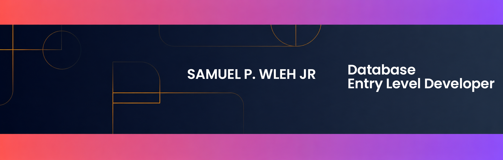

Samuel P. Wleh Jr

  

  <strong> Entry-Level Database Developer | Aspiring Backend Developer </strong>

  Nicosia, Northen Cyprus •
  <a href="https://www.linkedin.com/in/samuel-p-wleh-jr-20044730a">LinkedIn</a> •
  <a href="mailto:samuelpwlehjr13@gmail.com">Email</a>

I'm passionate about designing, managing, and optimizing databases to build efficient, data-driven systems. I enjoy solving real-world problems using SQL and continuously improving my skills in database design and backend development.

## About Me

- Strong foundation in SQL & Relational Databases
- Experience with query writing, table design & relationships
- Currently learning database optimization & normalization
- Building toward full backend development
- Open to internships, junior roles, and collaborations
- Studying at Cyprus International University
  
## My work currently centers on:

- Relational database design & schema architecture
- Writing and optimizing SQL queries for real-world use cases
- Database normalization and performance tuning
- Building backend-focused projects powered by structured data
- Expanding skills toward full backend development

## Focus Areas

- *SQL & Query Optimization: Writing clean, performant queries; indexing strategies and execution plans
- *Database Design: Normalization, schema design, entity-relationship modeling
- *Backend Development: Building data-driven applications with database foundations
- *Tools & Productivity: Microsoft SQL Server, MySQL, Excel for data analysis

## Tech Stack

\

## Learning & Certification

- Introduction to Databases For Back-End Development — Meta · Coursera 
- Google Project Management Professional Certificate
- Introduction to SQL — Simplilearn 

## 🌟 GitHub Contributions

## 📊 GitHub Analytics

| Repository Stats | Top Languages |
| --- | --- |
|  |  |

## 🐍 Contributions

## Collaboration

Open to collaborating on database projects, SQL challenges, backend applications, and anything that bridges data + design. Whether you need a database schema reviewed, a query optimized, or a creative eye on a tech project — let's connect!

## Fun Fact

I'm building my journey step-by-step — from learning SQL to becoming a professional backend developer and tech entrepreneur.

  <em>"Every great system starts with a well-designed database."</em>

